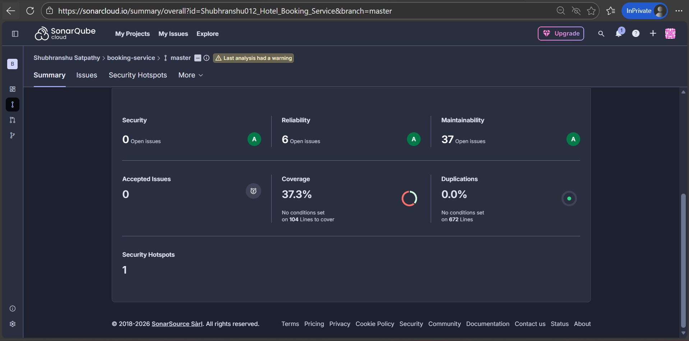
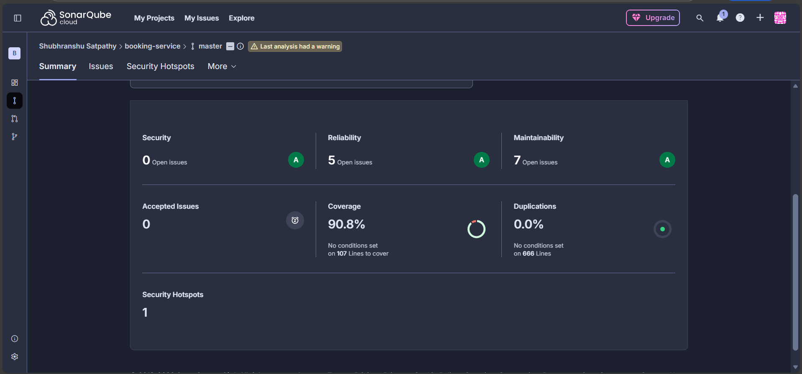
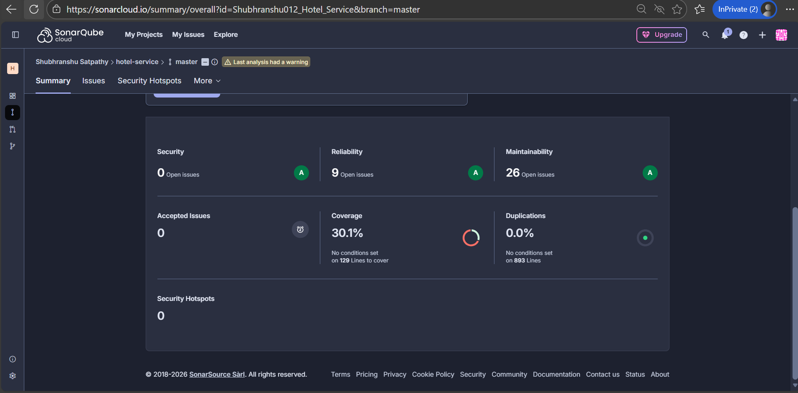
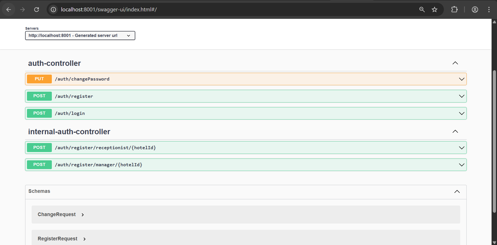
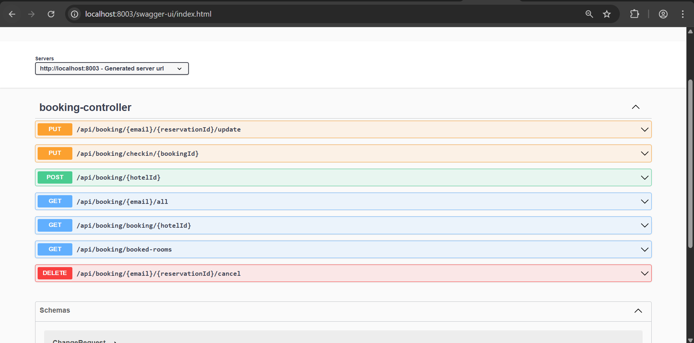
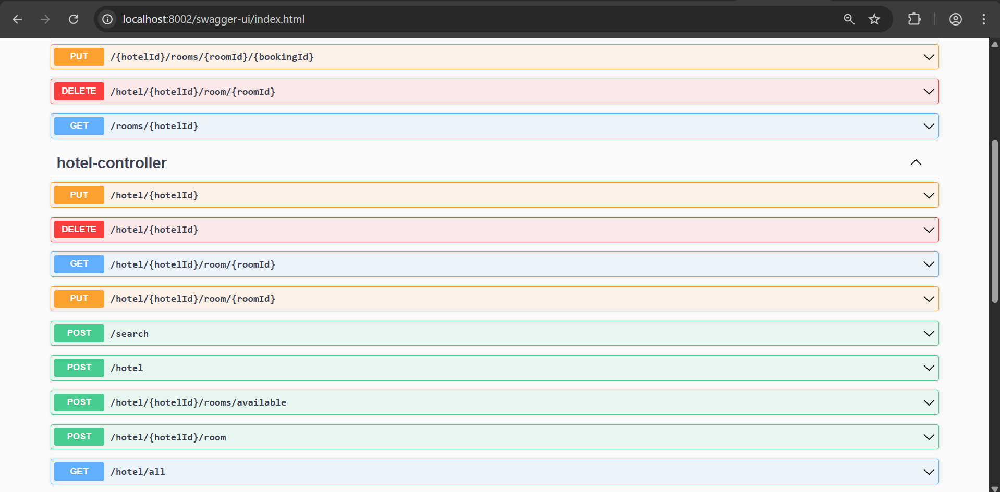

# Hotel Reservation System Backend

## Overview

The Hotel Reservation System is a comprehensive microservices-based application designed to manage hotel bookings, user authentication, and hotel/room management. Built using Spring Boot and Spring Cloud, it leverages modern cloud-native patterns for scalability and maintainability.

## Architecture

The system follows a microservices architecture with the following components:

- **API Gateway**: Routes requests to appropriate services and handles authentication via JWT.
- **Eureka Service Discovery**: Registers and discovers microservices.
- **Config Server**: Centralized configuration management.
- **Auth Service**: Handles user registration, login, and authentication.
- **Hotel Service**: Manages hotels and rooms, including search and availability.
- **Booking Service**: Manages reservations, cancellations, and check-ins.
- **Notification Service**: Handles event-driven notifications via Kafka.
- **Kafka**: Message broker for asynchronous communication.
- **MongoDB**: NoSQL database for data persistence.

## Technologies Used

- **Java 17**
- **Spring Boot 3.x**
- **Spring Cloud (Gateway, Eureka, Config)**
- **Spring Security**
- **JWT Authentication**
- **Kafka**
- **MongoDB**
- **Docker & Docker Compose**
- **Maven**

## Services and Endpoints

All endpoints are accessible through the API Gateway at `http://localhost:8008`.

### Auth Service

Handles user authentication and management.

| Method | Endpoint | Description | Access |
|--------|----------|-------------|--------|
| POST | `/auth/register` | Register a new user | Public |
| POST | `/auth/login` | User login | Public |
| PUT | `/auth/changePassword` | Change user password | Authenticated User |
| POST | `/auth/register/manager/{hotelId}` | Register a manager for a hotel | Admin |
| POST | `/auth/register/receptionist/{hotelId}` | Register a receptionist for a hotel | Manager |

### Hotel Service

Manages hotels and rooms.

| Method | Endpoint | Description | Access |
|--------|----------|-------------|--------|
| POST | `/hotel` | Add a new hotel | Admin |
| PUT | `/hotel/{hotelId}` | Update hotel details | Admin/Manager |
| DELETE | `/hotel/{hotelId}` | Delete a hotel | Admin |
| GET | `/hotel/all` | Get all hotels | Admin |
| POST | `/hotel/{hotelId}/room` | Add rooms to a hotel | Manager |
| PUT | `/hotel/{hotelId}/room/{roomId}` | Update room details | Manager |
| POST | `/search` | Search hotels by criteria | Public |
| POST | `/hotel/{hotelId}/rooms/available` | Get available rooms for dates | Public |
| GET | `rooms/{hotelId}` | Get all rooms in a hotel | Manager |
| PUT | `{hotelId}/rooms/{roomId}/{bookingId}` | Check-in/check-out for a room | Receptionist |
| DELETE | `/hotel/{hotelId}/room/{roomId}` | Delete a room | Manager |

### Booking Service

Manages reservations and bookings.

| Method | Endpoint | Description | Access |
|--------|----------|-------------|--------|
| POST | `/api/booking/{hotelId}` | Create a new booking | User/Receptionist |
| DELETE | `/api/booking/{email}/{reservationId}/cancel` | Cancel a booking | User |
| GET | `/api/booking/{email}/all` | Get all bookings for a user | User |
| GET | `/api/booking/booking/{hotelId}` | Get all bookings for a hotel | Manager |
| PUT | `/api/booking/{email}/{reservationId}/update` | Update a booking | User |
| PUT | `/api/booking/checkin/{bookingId}` | Check-in/check-out a booking | Receptionist |

## Setup and Installation

### Prerequisites

- Docker and Docker Compose
- Java 17 (for local development)
- Maven

### Running with Docker

1. Clone the repository:
   ```bash
   git clone <repository-url>
   cd Hotel_Backend
   ```

2. Build and start all services:
   ```bash
   docker-compose up --build
   ```

3. The application will be available at:
   - API Gateway: `http://localhost:8008`
   - Eureka Dashboard: `http://localhost:8761`
   - Config Server: `http://localhost:8888`

### Local Development

1. Start infrastructure services (MongoDB, Kafka, Zookeeper):
   ```bash
   docker-compose up mongodb kafka zookeeper
   ```

2. Start Config Server:
   ```bash
   cd configserver
   mvn spring-boot:run
   ```

3. Start Eureka Server:
   ```bash
   cd eureka-service
   mvn spring-boot:run
   ```

4. Start individual services in order:
   - Auth Service
   - Hotel Service
   - Booking Service
   - API Gateway

## API Documentation

## Database

The system uses MongoDB with separate databases for each service:
- `HotelAuthdb` - Auth Service
- `Hoteldb` - Hotel Service
- `HotelBookingdb` - Booking Service

## Message Queue

Kafka is used for event-driven communication between services, particularly for booking notifications.

## Security

- JWT-based authentication
- Role-based access control (USER, MANAGER, ADMIN)
- CORS enabled for cross-origin requests

## Monitoring and Quality

- SonarQube integration for code quality analysis
- Docker containerization for consistent deployment

### SonarQube Reports

- **Booking Service Before**: 
- **Booking Service After**: 
- **Hotel Service Before**: 

### Swagger Documentation Screenshots

- **Auth Service**: 
- **Booking Service**: 
- **Hotel Service**: 

## Project Structure

```
Hotel_Backend/
├── apigateway/          # API Gateway service
├── auth-service/        # Authentication service
├── booking-service/     # Booking management service
├── configserver/        # Configuration server
├── eureka-service/      # Service discovery
├── hotel-service/       # Hotel and room management
├── docker-compose.yml   # Docker orchestration
└── README.md
```


